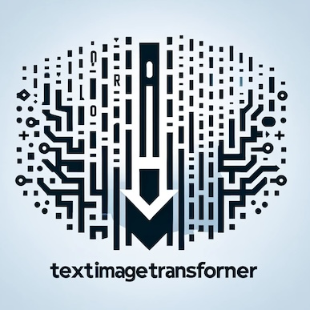

# Text Image Transformer
This Python project allows you to convert text into ASCII images and vice versa, from ASCII images to text. The code is inspired by Terence Eden's blog article "Compressing Text Into Images" (https://shkspr.mobi/blog/2024/01/compressing-text-into-images/).



# Usage

## From Text to Image (`text_to_image.py`)
1. Place the text you want to convert into a file named `text_input.txt` in the same directory as `text_to_image.py`.
2. Run `text_to_image.py` to convert the text into an ASCII image.
3. The ASCII image will be saved as `ascii_grey.png`.

## From Image to Text (`image_to_text.py`)
1. Ensure you have an ASCII image named `ascii_grey.png` in the same directory as `image_to_text.py`.
2. Run `image_to_text.py` to convert the ASCII image back into text.
3. The text will be saved in a file named `text_output.txt`.

## Customization
You can customize the width of the ASCII image by modifying the `width` variable in `text_to_image.py`. Changing this value will affect the width of the resulting image.

## Testing with Large Images
If you need to perform tests with large images, you can refer to this repository: [dscape/spell - test/resources/big.txt](https://github.com/dscape/spell/blob/master/test/resources/big.txt). You will find an example of a large text file that can be used to evaluate the script's performance.

## Dependencies
This project uses the Python Imaging Library (PIL) for image processing. You can install it using `pip` if you haven't already:

```bash
pip install pillow
```

## Example
An example text file named `text_input.txt` and the resulting ASCII image `ascii_grey.png` are included in this repository for demonstration purposes.

## License
This project is open-source and available under the MIT License. Feel free to use and modify the code as you wish.
